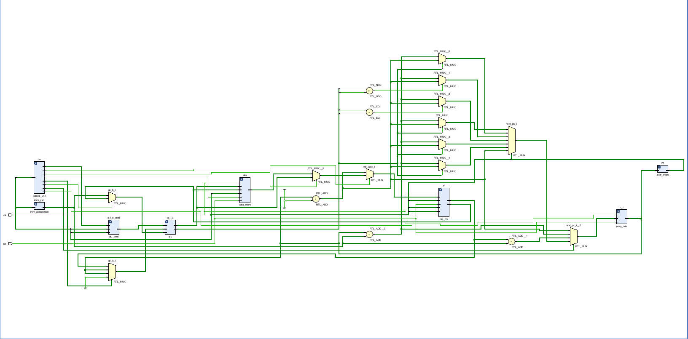

# risc-v_single_cycle_processor

This repository contains the implementation of a **RISC-V RV32I single-cycle processor** written in **SystemVerilog**.  
It was developed as part of my Design Verification (DV) Engineer training, with a focus on RTL design, verification, and computer architecture.

---

## 📚 Overview
The processor implements the **RV32I base instruction set architecture (ISA)** of RISC-V.  
It follows a **single-cycle datapath design**, where each instruction is fetched, decoded, executed, and completed in one clock cycle.

---

## 🚀 Features
- ✅ Supports **RISC-V RV32I** instructions
- ✅ **Single-cycle datapath**
- ✅ **ALU** supporting arithmetic and logic operations
- ✅ **Register file** with 32 registers (x0–x31)
- ✅ **Instruction memory** (initialized from `instr.mem`)
- ✅ **Data memory** for load/store instructions
- ✅ **Control unit** for decoding instructions
- ✅ Testbench included for simulation

---

## 📂 Repository Structure
```

riscv-single-cycle-processor/
│
├── src/
│   ├── rtl/              # RTL modules and top-level design
│   │   ├── alu.sv
│   │   ├── control\_unit.sv
│   │   ├── regfile.sv
│   │   ├── instr\_mem.sv
│   │   ├── data\_mem.sv
│   │   └── top.sv
│   │
│   ├── tb/               # Testbench
│   │   └── top\_tb.sv
│   │
│   └── hex\_file/         # Instruction memory initialization
│       └── instr.mem
│
└── README.md

````

---

## ▶️ Simulation Guide

### 🔹 Using Xilinx Vivado
```tcl
# Compile RTL + TB
xvlog src/rtl/*.sv src/tb/*.sv

# Elaborate the top-level testbench
xelab top_tb -s top_sim

# Run the simulation
xsim top_sim --runall
````

### 🔹 Using Cadence Xcelium

```bash
xrun -sv src/rtl/*.sv src/tb/*.sv
```

### 🔹 Instruction Memory

The program to be executed is stored in **hex format** inside:

```
src/hex_file/instr.mem
```

This file is preloaded into the instruction memory during simulation.

---

## 🖼️ Datapath Diagram (Conceptual)




---

## 📌 Future Improvements

* Add **5-stage pipelining** (IF, ID, EX, MEM, WB).[done](https://github.com/Ali-975/rv32i-5-stage-pipelined-processor/commit/08cee43783c2a093c5489a0821a3658e63fe5d8b)
* Implement **branch prediction**
* Add **hazard detection and forwarding**
* FPGA implementation on **Nexys A7 board**
* UVM-based verification environment

---

## 📜 License

This project is for **educational purposes** as part of DV Engineer training.
Feel free to fork and extend for your own learning.

---

## ✍️ Author

**Muddassir Ali Siddiqui**

DV Engineer Trainee

NCDC Islamabad
